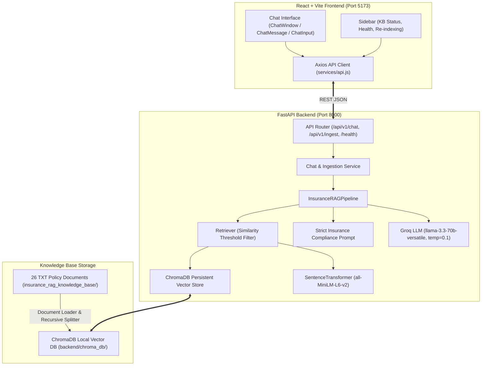

# Insurance Policy Q&A Assistant (RAG Chatbot)

A complete, production-grade Insurance Question and Answer chatbot built with **Retrieval-Augmented Generation (RAG)**. The application features a decoupled architecture with a high-performance **Python FastAPI** backend (using **LangChain**, **Groq API**, **HuggingFace Sentence Transformers**, and **ChromaDB**) and a sleek **React + Vite** frontend with live knowledge-base monitoring and verifiable source citations.

---

## 🏛️ Architecture Overview



---

## ✨ Key Features

- **Strict Insurance Compliance**: AI answers **strictly from retrieved policy documents**. Never hallucinates fake coverage or limits.
- **Verifiable Source Citations**: Every response includes expandable citation cards showing the filename, document category badge, relevance score, and source excerpt preview.
- **Decoupled Architecture**: Clean separation between React frontend and FastAPI backend communicating via RESTful JSON.
- **Configurable Embedding & LLM**: Fully environment-variable driven (Groq models such as `llama-3.3-70b-versatile`, HuggingFace models such as `all-MiniLM-L6-v2`).
- **Persistent Vector Storage**: Local ChromaDB storage with duplicate prevention via chunk IDs.
- **Live System Telemetry**: Real-time status indicators in the sidebar for backend health, indexed document count, chunk count, and on-demand re-indexing.
- **Full Test Suite**: Automated Pytest tests for document loading, splitting, similarity filtering, prompt compliance, and API validation.
- **Containerized**: Production-ready `Dockerfile` and `docker-compose.yml`.

---

## 📁 Project Structure

```
RAG_CLAIM_Q&A_chatbot/
│
├── insurance_rag_knowledge_base/        # 26 Official TXT insurance policy documents
│   ├── health_policy_overview.txt
│   ├── health_waiting_periods.txt
│   ├── motor_comprehensive.txt
│   ├── motor_claims.txt
│   ├── claims_process.txt
│   └── ...
│
├── backend/
│   ├── app/
│   │   ├── __init__.py
│   │   ├── main.py                     # FastAPI app, CORS, lifespans, exception handlers
│   │   ├── config.py                   # Centralized Pydantic/dotenv configuration
│   │   ├── api/
│   │   │   ├── __init__.py
│   │   │   ├── routes.py               # Endpoints: /chat, /ingest, /knowledge-base/status, /health
│   │   │   └── schemas.py              # Pydantic request/response validation
│   │   ├── rag/
│   │   │   ├── __init__.py
│   │   │   ├── document_loader.py      # Recursive TXT loader with auto-classification
│   │   │   ├── text_splitter.py        # RecursiveCharacterTextSplitter with chunk IDs
│   │   │   ├── embeddings.py           # HuggingFace SentenceTransformer singleton
│   │   │   ├── vector_store.py         # Persistent ChromaDB manager
│   │   │   ├── retriever.py            # Similarity search with score thresholding
│   │   │   ├── prompt.py               # Strict compliance prompt template
│   │   │   └── rag_pipeline.py         # RAG pipeline coordinating retrieval, LLM & citations
│   │   ├── services/
│   │   │   ├── __init__.py
│   │   │   └── chat_service.py         # Business logic layer
│   │   └── utils/
│   │       ├── __init__.py
│   │       └── logger.py               # Structured logger with secret redaction
│   ├── scripts/
│   │   └── ingest.py                   # CLI ingestion tool
│   ├── tests/
│   │   ├── __init__.py
│   │   ├── test_api.py                 # FastAPI endpoint & validation tests
│   │   ├── test_ingestion.py           # Document loader & splitter tests
│   │   └── test_rag.py                 # Prompt & source formatting tests
│   ├── chroma_db/                      # Local persistent ChromaDB files (generated)
│   ├── Dockerfile
│   ├── requirements.txt
│   ├── .env
│   └── .env.example
│
├── frontend/
│   ├── public/
│   │   └── shield.svg
│   ├── src/
│   │   ├── components/
│   │   │   ├── ChatWindow.jsx          # Main chat container with welcome & suggested chips
│   │   │   ├── ChatMessage.jsx         # Message bubble with copy, formatting & sources
│   │   │   ├── ChatInput.jsx           # Expanding textarea, counter & keyboard shortcuts
│   │   │   ├── SourceCard.jsx          # Expandable source citation card with previews
│   │   │   ├── Sidebar.jsx             # Status, re-index button, new chat, models
│   │   │   └── LoadingIndicator.jsx    # Animated typing & context shimmer
│   │   ├── services/
│   │   │   └── api.js                  # Axios client for backend endpoints
│   │   ├── hooks/
│   │   │   └── useChat.js              # Chat state management
│   │   ├── App.jsx                     # Layout shell
│   │   ├── main.jsx                    # React entrypoint
│   │   └── index.css                   # Modern dark glassmorphism stylesheet
│   ├── index.html
│   ├── Dockerfile
│   ├── package.json
│   ├── vite.config.js
│   ├── .env
│   └── .env.example
│
├── docker-compose.yml
├── .gitignore
└── README.md
```

---

## ⚙️ Prerequisites

- **Python**: 3.11 recommended (Python 3.10 - 3.12 supported)
- **Node.js**: v18+ (tested on Node v24)
- **Groq API Key**: Free tier or paid API key from [Groq Console](https://console.groq.com)

---

## 🚀 Step-by-Step Setup

### 1. Configure Environment Variables

#### Backend Configuration:
Edit `backend/.env`:
```env
GROQ_API_KEY=gsk_your_actual_groq_api_key_here
GROQ_MODEL=llama-3.3-70b-versatile
EMBEDDING_MODEL=sentence-transformers/all-MiniLM-L6-v2
CHROMA_PERSIST_DIRECTORY=./chroma_db
CHROMA_COLLECTION_NAME=insurance_knowledge_base
DOCUMENT_DIRECTORY=../insurance_rag_knowledge_base
CHUNK_SIZE=800
CHUNK_OVERLAP=150
TOP_K_RESULTS=5
SIMILARITY_THRESHOLD=0.35
APP_NAME=Insurance RAG Q&A API
APP_VERSION=1.0.0
DEBUG=True
HOST=0.0.0.0
PORT=8000
FRONTEND_URL=http://localhost:5173
```

#### Frontend Configuration:
Edit `frontend/.env`:
```env
VITE_API_BASE_URL=http://localhost:8000
```

---

### 2. Backend Installation & Setup

```bash
# Navigate to backend directory
cd backend

# Create virtual environment (Python 3.11)
py -3.11 -m venv venv

# Activate virtual environment
# Windows:
.\venv\Scripts\activate
# macOS/Linux:
source venv/bin/activate

# Install requirements
pip install -r requirements.txt
```

---

### 3. Ingest Documents into ChromaDB

Run the standalone ingestion CLI to parse all 26 policy text files, create semantic chunks, generate embeddings, and persist to local ChromaDB:

```bash
# Inside backend directory with venv activated:
python scripts/ingest.py

# Optional: To force a clean re-indexing from scratch:
python scripts/ingest.py --reset
```

Expected output:
```
=================================================================
       INSURANCE RAG KNOWLEDGE BASE INGESTION TOOL
=================================================================
Knowledge Base Directory: ../insurance_rag_knowledge_base
ChromaDB Persist Directory: ./chroma_db
ChromaDB Collection Name: insurance_knowledge_base
Embedding Model: sentence-transformers/all-MiniLM-L6-v2
Chunk Size: 800 | Chunk Overlap: 150
-----------------------------------------------------------------
[*] Loading documents from knowledge base...
[+] Documents loaded: 26
[*] Splitting documents into semantic chunks...
[+] Chunks generated: 104
[*] Generating embeddings and storing in ChromaDB...
-----------------------------------------------------------------
[+] Embeddings created successfully
[+] ChromaDB persisted successfully
    - Chunks freshly added: 104
    - Total chunks in ChromaDB: 104
    - Total unique policy documents: 26
=================================================================
Ingestion completed successfully!
```

---

### 4. Run Backend Server

```bash
# Inside backend directory with venv activated:
python -m uvicorn app.main:app --host 0.0.0.0 --port 8000 --reload
```

- **API Base URL**: `http://localhost:8000`
- **Interactive Swagger Docs**: `http://localhost:8000/docs`
- **ReDoc Documentation**: `http://localhost:8000/redoc`

---

### 5. Frontend Installation & Run

Open a new terminal:

```bash
# Navigate to frontend directory
cd frontend

# Install npm packages
npm install

# Start Vite dev server
npm run dev
```

- **Frontend Application URL**: `http://localhost:5173`

---

## 🐳 Docker Deployment (Alternative)

To spin up both frontend and backend in isolated containers:

```bash
docker-compose up --build
```
- Access Frontend: `http://localhost:5173`
- Access Backend API: `http://localhost:8000`

---

## 🧪 Running Automated Tests

Run backend unit and integration tests with Pytest:

```bash
cd backend
.\venv\Scripts\python.exe -m pytest tests/ -v
```

---

## 📡 API Reference

| Method | Endpoint | Description |
|---|---|---|
| `GET` | `/` | API status check |
| `GET` | `/health` | Health and version info |
| `POST` | `/api/v1/chat` | Ask question, get AI answer with source citations |
| `POST` | `/api/v1/ingest` | Trigger knowledge base ingestion |
| `GET` | `/api/v1/knowledge-base/status` | Real-time ChromaDB status & metrics |

### Example Chat Request:
```json
POST /api/v1/chat
Content-Type: application/json

{
  "question": "What is the waiting period for pre-existing diseases?"
}
```

### Example Chat Response:
```json
{
  "answer": "Under SecureLife Health Insurance, coverage for eligible pre-existing diseases generally begins after a waiting period of 24 continuous months, subject to specific policy terms.\n\nKey rules include:\n- Waiting periods are measured from the commencement of continuous coverage.\n- Completion of the waiting period does not guarantee automatic payment; treatments must satisfy medical necessity.\n- Final coverage and claim eligibility depend on the specific policy terms and conditions.",
  "sources": [
    {
      "filename": "health_waiting_periods.txt",
      "document_type": "health",
      "preview": "PRE-EXISTING DISEASE WAITING PERIOD: A pre-existing disease is generally a medical condition, illness, injury, or symptom that existed or was diagnosed before policy commencement...",
      "similarity_score": 0.8841
    }
  ],
  "processing_time": 0.76
}
```

---

## 💡 Example Questions to Try

1. **Health Insurance**:
   - *"What is the waiting period for pre-existing diseases?"*
   - *"What are the requirements for cashless hospitalization?"*
2. **Motor Insurance**:
   - *"Does comprehensive motor insurance cover theft?"*
   - *"What documents are required for a motor insurance claim?"*
3. **Claims & Exclusions**:
   - *"How do I file an insurance claim?"*
   - *"What are common reasons for an insurance claim rejection?"*
   - *"What are general exclusions that apply across policies?"*
4. **Policy Management**:
   - *"Can I cancel my insurance policy and receive a refund?"*
   - *"What happens if I miss a premium payment?"*
5. **Out of Knowledge Base Guardrail**:
   - *"Can I get pet insurance for my exotic dinosaur?"*
   - Response: *"I could not find this information in the available insurance policy documents..."*
